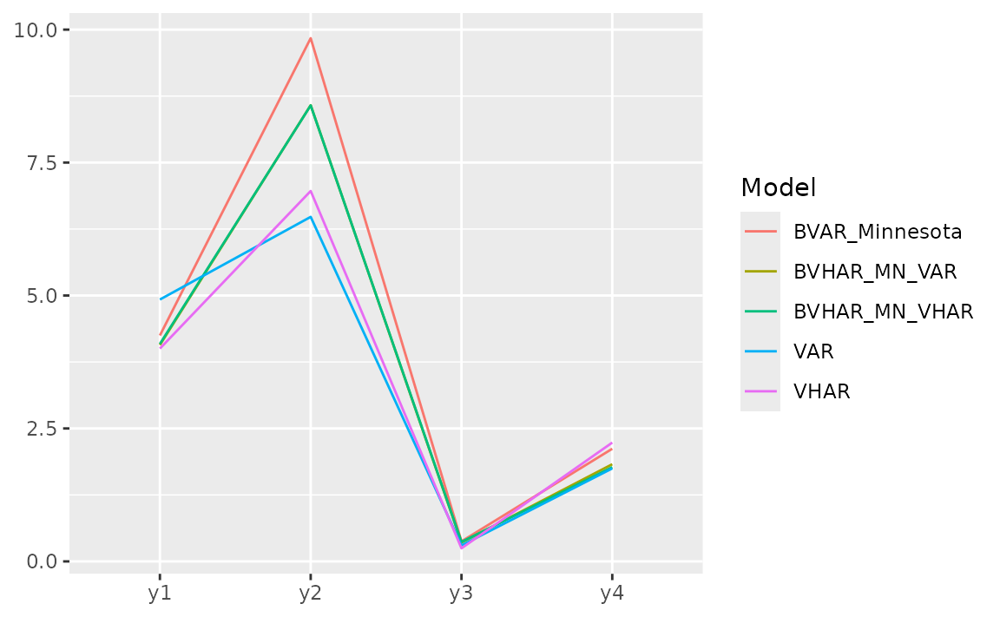

# Forecasting

``` r
library(bvhar)
```

## Simulation

Given VAR coefficient and VHAR coefficient each,

- `sim_var(num_sim, num_burn, var_coef, var_lag, sig_error, init)`
  generates VAR process
- `sim_vhar(num_sim, num_burn, vhar_coef, sig_error, init)` generates
  VHAR process

We use coefficient matrix estimated by VAR(5) in introduction vignette.

Consider

``` r
coef(ex_fit)
#>              GVZCLS   OVXCLS    EVZCLS VXFXICLS
#> GVZCLS_1    0.93302 -0.02332 -0.007712 -0.03853
#> OVXCLS_1    0.05429  1.00399  0.009806  0.01062
#> EVZCLS_1    0.06794 -0.13900  0.983825  0.07783
#> VXFXICLS_1 -0.03399  0.03404  0.020719  0.93350
#> GVZCLS_2   -0.07831  0.08753  0.019302  0.08939
#> OVXCLS_2   -0.04770  0.01480  0.003888  0.04392
#> EVZCLS_2    0.08082  0.26704 -0.110017 -0.07163
#> VXFXICLS_2  0.05465 -0.12154 -0.040349  0.04012
#> GVZCLS_3    0.04332 -0.02459 -0.011041 -0.02556
#> OVXCLS_3   -0.00594 -0.09550  0.006638 -0.04981
#> EVZCLS_3   -0.02952 -0.04926  0.091056  0.01204
#> VXFXICLS_3 -0.05876 -0.05995  0.003803 -0.02027
#> GVZCLS_4   -0.00845 -0.04490  0.005415 -0.00817
#> OVXCLS_4    0.01070 -0.00383 -0.022806 -0.05557
#> EVZCLS_4   -0.01971 -0.02008 -0.016535  0.08229
#> VXFXICLS_4  0.06139  0.14403  0.019780 -0.10271
#> GVZCLS_5    0.07301  0.01093 -0.010994 -0.01526
#> OVXCLS_5   -0.01658  0.07401  0.007035  0.04297
#> EVZCLS_5   -0.08794 -0.06189  0.021082 -0.02465
#> VXFXICLS_5 -0.01739  0.00169  0.000335  0.09384
#> const       0.57370  0.15256  0.132842  0.87785
ex_fit$covmat
#>          GVZCLS OVXCLS EVZCLS VXFXICLS
#> GVZCLS    1.157  0.403  0.127    0.332
#> OVXCLS    0.403  1.740  0.115    0.438
#> EVZCLS    0.127  0.115  0.144    0.127
#> VXFXICLS  0.332  0.438  0.127    1.028
```

Then

``` r
m <- ncol(ex_fit$coefficients)
# generate VAR(5)-----------------
y <- sim_var(
  num_sim = 1500, 
  num_burn = 100, 
  var_coef = coef(ex_fit), 
  var_lag = 5L, 
  sig_error = ex_fit$covmat, 
  init = matrix(0L, nrow = 5L, ncol = m)
)
# colname: y1, y2, ...------------
colnames(y) <- paste0("y", 1:m)
head(y)
#>        y1   y2   y3   y4
#> [1,] 10.4 23.7 7.93 25.6
#> [2,] 11.5 22.8 8.57 25.6
#> [3,] 17.1 24.3 8.66 29.2
#> [4,] 16.9 24.1 8.48 29.5
#> [5,] 16.5 23.2 8.29 29.2
#> [6,] 16.3 24.2 8.31 28.7
```

``` r
h <- 20
y_eval <- divide_ts(y, h)
y_train <- y_eval$train # train
y_test <- y_eval$test # test
```

## Fitting Models

### VAR(5) and VHAR

``` r
# VAR(5)
model_var <- var_lm(y_train, 5)
# VHAR
model_vhar <- vhar_lm(y_train)
```

### BVAR(5)

Minnesota prior

``` r
# hyper parameters---------------------------
y_sig <- apply(y_train, 2, sd) # sigma vector
y_lam <- .2 # lambda
y_delta <- rep(.2, m) # delta vector (0 vector since RV stationary)
eps <- 1e-04 # very small number
spec_bvar <- set_bvar(y_sig, y_lam, y_delta, eps)
# fit---------------------------------------
model_bvar <- bvar_minnesota(y_train, p = 5, bayes_spec = spec_bvar)
```

### BVHAR

BVHAR-S

``` r
spec_bvhar_v1 <- set_bvhar(y_sig, y_lam, y_delta, eps)
# fit---------------------------------------
model_bvhar_v1 <- bvhar_minnesota(y_train, bayes_spec = spec_bvhar_v1)
```

BVHAR-L

``` r
# weights----------------------------------
y_day <- rep(.1, m)
y_week <- rep(.01, m)
y_month <- rep(.01, m)
# spec-------------------------------------
spec_bvhar_v2 <- set_weight_bvhar(
  y_sig,
  y_lam,
  eps,
  y_day,
  y_week,
  y_month
)
# fit--------------------------------------
model_bvhar_v2 <- bvhar_minnesota(y_train, bayes_spec = spec_bvhar_v2)
```

## Splitting

You can forecast using [`predict()`](../reference/predict.md) method
with above objects. You should set the step of the forecasting using
`n_ahead` argument.

In addition, the result of this forecast will return another class
called `predbvhar` to use some methods,

- Plot: [`autoplot.predbvhar()`](../reference/autoplot.predbvhar.md)
- Evaluation: [`mse.predbvhar()`](../reference/mse.md),
  [`mae.predbvhar()`](../reference/mae.md),
  [`mape.predbvhar()`](../reference/mape.md),
  [`mase.predbvhar()`](../reference/mase.md),
  [`mrae.predbvhar()`](../reference/mrae.md),
  [`relmae.predbvhar()`](../reference/relmae.md)
- Relative error: [`rmape.predbvhar()`](../reference/rmape.md),
  [`rmase.predbvhar()`](../reference/rmase.md),
  [`rmase.predbvhar()`](../reference/rmase.md),
  [`rmsfe.predbvhar()`](../reference/rmsfe.md),
  [`rmafe.predbvhar()`](../reference/rmafe.md)

### VAR

``` r
(pred_var <- predict(model_var, n_ahead = h))
#>         y1   y2   y3   y4
#>  [1,] 20.1 26.8 10.7 34.1
#>  [2,] 19.8 26.3 10.6 33.6
#>  [3,] 19.7 26.2 10.6 33.1
#>  [4,] 19.7 26.0 10.6 32.7
#>  [5,] 19.7 26.0 10.6 32.3
#>  [6,] 19.6 26.0 10.6 32.0
#>  [7,] 19.5 25.9 10.6 31.7
#>  [8,] 19.5 25.8 10.5 31.4
#>  [9,] 19.4 25.7 10.5 31.1
#> [10,] 19.4 25.6 10.5 30.9
#> [11,] 19.4 25.5 10.5 30.7
#> [12,] 19.3 25.4 10.4 30.4
#> [13,] 19.3 25.3 10.4 30.2
#> [14,] 19.2 25.2 10.4 30.0
#> [15,] 19.2 25.1 10.4 29.8
#> [16,] 19.2 25.0 10.3 29.7
#> [17,] 19.1 24.9 10.3 29.5
#> [18,] 19.1 24.8 10.3 29.4
#> [19,] 19.1 24.7 10.3 29.2
#> [20,] 19.1 24.5 10.2 29.1
```

``` r
class(pred_var)
#> [1] "predbvhar"
names(pred_var)
#> [1] "process"     "forecast"    "se"          "lower"       "upper"      
#> [6] "lower_joint" "upper_joint" "y"
```

The package provides the evaluation function

- `mse(predbvhar, test)`: MSE
- `mape(predbvhar, test)`: MAPE

``` r
(mse_var <- mse(pred_var, y_test))
#>    y1    y2    y3    y4 
#> 4.924 6.479 0.301 1.749
```

### VHAR

``` r
(pred_vhar <- predict(model_vhar, n_ahead = h))
#>         y1   y2   y3   y4
#>  [1,] 19.9 26.5 10.6 34.0
#>  [2,] 19.8 26.1 10.6 33.5
#>  [3,] 19.7 25.9 10.6 33.1
#>  [4,] 19.7 25.7 10.5 32.7
#>  [5,] 19.6 25.6 10.5 32.3
#>  [6,] 19.6 25.5 10.5 31.9
#>  [7,] 19.6 25.4 10.4 31.5
#>  [8,] 19.6 25.3 10.4 31.2
#>  [9,] 19.6 25.2 10.4 30.9
#> [10,] 19.5 25.1 10.4 30.6
#> [11,] 19.5 25.1 10.4 30.3
#> [12,] 19.5 25.0 10.3 30.0
#> [13,] 19.5 25.0 10.3 29.8
#> [14,] 19.5 24.9 10.3 29.6
#> [15,] 19.5 24.9 10.3 29.4
#> [16,] 19.5 24.9 10.3 29.2
#> [17,] 19.5 24.9 10.3 29.0
#> [18,] 19.5 24.9 10.3 28.9
#> [19,] 19.5 24.8 10.3 28.7
#> [20,] 19.5 24.8 10.3 28.6
```

MSE:

``` r
(mse_vhar <- mse(pred_vhar, y_test))
#>    y1    y2    y3    y4 
#> 4.002 6.965 0.246 2.235
```

### BVAR

``` r
(pred_bvar <- predict(model_bvar, n_ahead = h))
#>         y1   y2   y3   y4
#>  [1,] 19.8 22.2 8.66 27.8
#>  [2,] 19.3 19.8 7.87 25.7
#>  [3,] 19.0 18.4 7.43 24.8
#>  [4,] 18.8 17.4 7.15 24.3
#>  [5,] 18.6 16.8 6.97 24.0
#>  [6,] 18.5 16.4 6.84 23.8
#>  [7,] 18.5 16.1 6.76 23.7
#>  [8,] 18.4 15.9 6.72 23.6
#>  [9,] 18.4 15.8 6.69 23.6
#> [10,] 18.4 15.8 6.67 23.5
#> [11,] 18.4 15.7 6.66 23.5
#> [12,] 18.4 15.7 6.65 23.5
#> [13,] 18.4 15.7 6.65 23.5
#> [14,] 18.4 15.7 6.64 23.5
#> [15,] 18.4 15.7 6.64 23.5
#> [16,] 18.4 15.7 6.64 23.5
#> [17,] 18.4 15.7 6.64 23.5
#> [18,] 18.4 15.7 6.64 23.5
#> [19,] 18.4 15.7 6.64 23.5
#> [20,] 18.4 15.7 6.64 23.5
```

MSE:

``` r
(mse_bvar <- mse(pred_bvar, y_test))
#>     y1     y2     y3     y4 
#>   7.82 121.53  11.70  54.32
```

### BVHAR

#### VAR-type Minnesota

``` r
(pred_bvhar_v1 <- predict(model_bvhar_v1, n_ahead = h))
#>         y1   y2   y3   y4
#>  [1,] 19.7 21.4 8.70 34.9
#>  [2,] 19.5 19.7 8.10 35.3
#>  [3,] 19.4 19.2 7.92 35.7
#>  [4,] 19.4 19.0 7.87 36.2
#>  [5,] 19.4 18.9 7.86 36.7
#>  [6,] 19.4 18.9 7.87 37.1
#>  [7,] 19.4 18.9 7.89 37.7
#>  [8,] 19.4 19.0 7.92 38.2
#>  [9,] 19.4 19.1 7.96 38.7
#> [10,] 19.4 19.2 8.00 39.3
#> [11,] 19.5 19.3 8.05 39.9
#> [12,] 19.5 19.4 8.10 40.5
#> [13,] 19.6 19.5 8.15 41.1
#> [14,] 19.6 19.7 8.20 41.8
#> [15,] 19.6 19.8 8.26 42.5
#> [16,] 19.7 20.0 8.32 43.2
#> [17,] 19.7 20.1 8.38 43.9
#> [18,] 19.8 20.3 8.44 44.7
#> [19,] 19.8 20.5 8.50 45.4
#> [20,] 19.9 20.6 8.57 46.3
```

MSE:

``` r
(mse_bvhar_v1 <- mse(pred_bvhar_v1, y_test))
#>    y1    y2    y3    y4 
#>  3.47 60.46  4.49 92.74
```

#### VHAR-type Minnesota

``` r
(pred_bvhar_v2 <- predict(model_bvhar_v2, n_ahead = h))
#>             y1       y2       y3       y4
#>  [1,] 3.73e+01 1.87e+01 7.54e+00 2.52e+01
#>  [2,] 2.29e+02 1.71e+01 7.03e+00 2.40e+01
#>  [3,] 2.32e+03 2.03e+01 7.85e+00 2.51e+01
#>  [4,] 2.52e+04 6.02e+01 1.83e+01 3.85e+01
#>  [5,] 2.75e+05 4.98e+02 1.33e+02 1.85e+02
#>  [6,] 3.00e+06 5.28e+03 1.38e+03 1.79e+03
#>  [7,] 3.28e+07 5.76e+04 1.50e+04 1.93e+04
#>  [8,] 3.58e+08 6.29e+05 1.64e+05 2.11e+05
#>  [9,] 3.92e+09 6.87e+06 1.79e+06 2.30e+06
#> [10,] 4.28e+10 7.50e+07 1.96e+07 2.52e+07
#> [11,] 4.67e+11 8.19e+08 2.14e+08 2.75e+08
#> [12,] 5.10e+12 8.95e+09 2.33e+09 3.00e+09
#> [13,] 5.58e+13 9.77e+10 2.55e+10 3.28e+10
#> [14,] 6.09e+14 1.07e+12 2.79e+11 3.58e+11
#> [15,] 6.65e+15 1.17e+13 3.04e+12 3.91e+12
#> [16,] 7.27e+16 1.27e+14 3.32e+13 4.28e+13
#> [17,] 7.94e+17 1.39e+15 3.63e+14 4.67e+14
#> [18,] 8.67e+18 1.52e+16 3.97e+15 5.10e+15
#> [19,] 9.47e+19 1.66e+17 4.33e+16 5.57e+16
#> [20,] 1.03e+21 1.81e+18 4.73e+17 6.09e+17
```

MSE:

``` r
(mse_bvhar_v2 <- mse(pred_bvhar_v2, y_test))
#>       y1       y2       y3       y4 
#> 5.40e+40 1.66e+35 1.13e+34 1.87e+34
```

### Compare

#### Region

`autoplot(predbvhar)` and `autolayer(predbvhar)` draws the results of
the forecasting.

``` r
autoplot(pred_var, x_cut = 1470, ci_alpha = .7, type = "wrap") +
  autolayer(pred_vhar, ci_alpha = .5) +
  autolayer(pred_bvar, ci_alpha = .4) +
  autolayer(pred_bvhar_v1, ci_alpha = .2) +
  autolayer(pred_bvhar_v2, ci_alpha = .1) +
  geom_eval(y_test, colour = "#000000", alpha = .5)
#> Warning: `label` cannot be a <ggplot2::element_blank> object.
#> `label` cannot be a <ggplot2::element_blank> object.
```


#### Error

Mean of MSE

``` r
list(
  VAR = mse_var,
  VHAR = mse_vhar,
  BVAR = mse_bvar,
  BVHAR1 = mse_bvhar_v1,
  BVHAR2 = mse_bvhar_v2
) |> 
  lapply(mean) |> 
  unlist() |> 
  sort()
#>     VHAR      VAR   BVHAR1     BVAR   BVHAR2 
#> 3.36e+00 3.36e+00 4.03e+01 4.88e+01 1.35e+40
```

For each variable, we can see the error with plot.

``` r
list(
  pred_var,
  pred_vhar,
  pred_bvar,
  pred_bvhar_v1,
  pred_bvhar_v2
) |> 
  gg_loss(y = y_test, "mse")
#> Warning: `label` cannot be a <ggplot2::element_blank> object.
#> `label` cannot be a <ggplot2::element_blank> object.
```



Relative MAPE (MAPE), benchmark model: VAR

``` r
list(
  VAR = pred_var,
  VHAR = pred_vhar,
  BVAR = pred_bvar,
  BVHAR1 = pred_bvhar_v1,
  BVHAR2 = pred_bvhar_v2
) |> 
  lapply(rmape, pred_bench = pred_var, y = y_test) |> 
  unlist()
#>      VAR     VHAR     BVAR   BVHAR1   BVHAR2 
#> 1.00e+00 9.66e-01 4.59e+00 3.62e+00 1.02e+19
```

## Out-of-Sample Forecasting

In time series research, out-of-sample forecasting plays a key role. So,
we provide out-of-sample forecasting function based on

- Rolling window: `forecast_roll(object, n_ahead, y_test)`
- Expanding window: `forecast_expand(object, n_ahead, y_test)`

### Rolling windows

`forecast_roll(object, n_ahead, y_test)` conducts h \>= 1 step rolling
windows forecasting.

It fixes window size and moves the window. The window is the training
set. In this package, we set *window size = original input data*.

Iterating the step

1.  The model is fitted in the training set.
2.  With the fitted model, researcher should forecast the next h \>= 1
    step ahead. The longest forecast horizon is `num_test - h + 1`.
3.  After this window, move the window and do the same process.
4.  Get forecasted values until possible (longest forecast horizon).

5-step out-of-sample:

``` r
(var_roll <- forecast_roll(model_var, 5, y_test))
#>         y1   y2    y3   y4
#>  [1,] 19.7 26.0 10.58 32.3
#>  [2,] 18.6 25.1 10.08 31.3
#>  [3,] 18.4 24.3  9.84 30.9
#>  [4,] 18.1 24.5  9.68 30.5
#>  [5,] 19.2 25.5  9.99 31.3
#>  [6,] 19.2 26.8 10.23 30.9
#>  [7,] 19.3 27.3 10.13 30.1
#>  [8,] 20.4 28.2 10.38 29.5
#>  [9,] 20.1 28.3 10.30 30.3
#> [10,] 19.9 27.0 10.02 29.3
#> [11,] 19.6 26.7 10.05 29.5
#> [12,] 19.6 25.5  9.67 30.3
#> [13,] 20.8 26.6 10.14 29.8
#> [14,] 20.8 26.2 10.06 28.9
#> [15,] 20.6 25.6  9.91 28.9
#> [16,] 19.8 26.6 10.22 28.4
```

Denote that the nrow is longest forecast horizon.

``` r
class(var_roll)
#> [1] "predbvhar_roll" "bvharcv"
names(var_roll)
#> [1] "process"  "forecast" "eval_id"  "y"
```

To apply the same evaluation methods, a class named `bvharcv` has been
defined. You can use the functions above.

``` r
vhar_roll <- forecast_roll(model_vhar, 5, y_test)
bvar_roll <- forecast_roll(model_bvar, 5, y_test)
bvhar_roll_v1 <- forecast_roll(model_bvhar_v1, 5, y_test)
bvhar_roll_v2 <- forecast_roll(model_bvhar_v2, 5, y_test)
```

Relative MAPE, benchmark model: VAR

``` r
list(
  VAR = var_roll,
  VHAR = vhar_roll,
  BVAR = bvar_roll,
  BVHAR1 = bvhar_roll_v1,
  BVHAR2 = bvhar_roll_v2
) |> 
  lapply(rmape, pred_bench = var_roll, y = y_test) |> 
  unlist()
#>      VAR     VHAR     BVAR   BVHAR1   BVHAR2 
#> 1.00e+00 9.87e-01 1.78e+03 1.27e+05 5.59e+04
```

### Expanding Windows

`forecast_expand(object, n_ahead, y_test)` conducts h \>= 1 step
expanding window forecasting.

Different with rolling windows, expanding windows method fixes the
starting point. The other is same.

``` r
(var_expand <- forecast_expand(model_var, 5, y_test))
#>         y1   y2    y3   y4
#>  [1,] 19.7 26.0 10.58 32.3
#>  [2,] 18.6 25.1 10.09 31.3
#>  [3,] 18.4 24.4  9.84 30.9
#>  [4,] 18.1 24.5  9.68 30.4
#>  [5,] 19.2 25.6  9.99 31.3
#>  [6,] 19.2 26.8 10.25 30.9
#>  [7,] 19.3 27.3 10.15 30.2
#>  [8,] 20.4 28.2 10.39 29.6
#>  [9,] 20.0 28.3 10.31 30.3
#> [10,] 19.9 27.0 10.02 29.3
#> [11,] 19.6 26.7 10.06 29.5
#> [12,] 19.5 25.5  9.67 30.2
#> [13,] 20.7 26.6 10.13 29.8
#> [14,] 20.7 26.2 10.06 28.9
#> [15,] 20.5 25.6  9.92 28.9
#> [16,] 19.8 26.6 10.22 28.4
```

The class is `bvharcv`.

``` r
class(var_expand)
#> [1] "predbvhar_expand" "bvharcv"
names(var_expand)
#> [1] "process"  "forecast" "eval_id"  "y"
```

``` r
vhar_expand <- forecast_expand(model_vhar, 5, y_test)
bvar_expand <- forecast_expand(model_bvar, 5, y_test)
bvhar_expand_v1 <- forecast_expand(model_bvhar_v1, 5, y_test)
bvhar_expand_v2 <- forecast_expand(model_bvhar_v2, 5, y_test)
```

Relative MAPE, benchmark model: VAR

``` r
list(
  VAR = var_expand,
  VHAR = vhar_expand,
  BVAR = bvar_expand,
  BVHAR1 = bvhar_expand_v1,
  BVHAR2 = bvhar_expand_v2
) |> 
  lapply(rmape, pred_bench = var_expand, y = y_test) |> 
  unlist()
#>      VAR     VHAR     BVAR   BVHAR1   BVHAR2 
#>     1.00     0.98 10003.12 42210.04 47079.33
```
