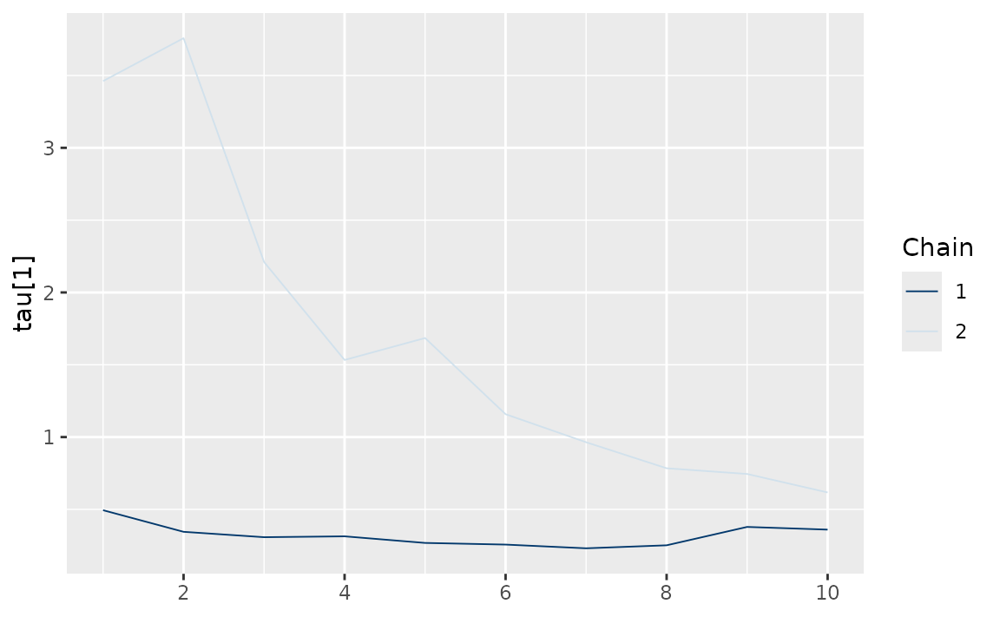

# Stochastic Volatility Models

``` r
library(bvhar)
```

``` r
etf <- etf_vix[1:55, 1:3]
# Split-------------------------------
h <- 5
etf_eval <- divide_ts(etf, h)
etf_train <- etf_eval$train
etf_test <- etf_eval$test
```

## Models with Stochastic Volatilities

By specifying `cov_spec = set_sv()`,
[`var_bayes()`](../reference/var_bayes.md) and
[`vhar_bayes()`](../reference/vhar_bayes.md) fits VAR-SV and VHAR-SV
with shrinkage priors, respectively.

- Three different prior for innovation covariance, and specify through
  `coef_spec`
  - Minneosta prior
    - BVAR: [`set_bvar()`](../reference/set_bvar.md)
    - BVHAR: [`set_bvhar()`](../reference/set_bvar.md) and
      [`set_weight_bvhar()`](../reference/set_bvar.md)
  - SSVS prior: [`set_ssvs()`](../reference/set_ssvs.md)
  - Horseshoe prior: [`set_horseshoe()`](../reference/set_horseshoe.md)
  - NG prior: [`set_ng()`](../reference/set_ng.md)
  - DL prior: [`set_dl()`](../reference/set_dl.md)
- `sv_spec`: prior settings for SV,
  [`set_sv()`](../reference/set_ldlt.md)
- `intercept`: prior for constant term,
  [`set_intercept()`](../reference/set_intercept.md)

``` r
set_sv()
#> Model Specification for SV with Cholesky Prior
#> 
#> Parameters: Contemporaneous coefficients, State variance, Initial state
#> Prior: Cholesky
#> ========================================================
#> Setting for 'shape':
#> [1]  rep(3, dim)
#> 
#> Setting for 'scale':
#> [1]  rep(0.01, dim)
#> 
#> Setting for 'initial_mean':
#> [1]  rep(1, dim)
#> 
#> Setting for 'initial_prec':
#> [1]  0.1 * diag(dim)
```

### SSVS

``` r
(fit_ssvs <- vhar_bayes(etf_train, num_chains = 2, num_iter = 20, coef_spec = set_ssvs(), cov_spec = set_sv(), include_mean = FALSE, minnesota = "longrun"))
#> Call:
#> vhar_bayes(y = etf_train, num_chains = 2, num_iter = 20, coef_spec = set_ssvs(), 
#>     cov_spec = set_sv(), include_mean = FALSE, minnesota = "longrun")
#> 
#> BVHAR with Stochastic Volatility
#> Fitted by Gibbs sampling
#> Number of chains: 2
#> Total number of iteration: 20
#> Number of burn-in: 10
#> ====================================================
#> 
#> Parameter Record:
#> # A draws_df: 10 iterations, 2 chains, and 177 variables
#>      phi[1]  phi[2]   phi[3]   phi[4]   phi[5]  phi[6]   phi[7]   phi[8]
#> 1    2.0378  -1.530  -0.4724   0.0931   0.5095   0.604   0.0211   0.4329
#> 2    0.1705  -0.800  -0.2281  -0.4403   2.9574   0.956  -0.1733   0.0617
#> 3   -0.3421   0.231   0.4953  -0.3483  -1.0906   0.743  -0.3380   0.3244
#> 4   -0.6871  -0.747  -1.1890   0.3063  -0.1388   0.391   0.6782   0.3690
#> 5   -0.5046  -0.267   0.6911   0.0282  -1.5456   0.350   1.3570   0.3457
#> 6    0.0193  -0.258   0.2528   0.0561   0.7600   0.663   0.0459   0.0450
#> 7    0.0959  -0.222   0.3132   0.3400  -0.7104   0.454  -0.0453  -0.0261
#> 8   -0.0914  -0.161   0.0668   0.7743   0.5555   0.240   0.4406  -0.0356
#> 9    0.2749  -0.271  -0.1831   0.5293  -0.0446   0.642  -0.1664   0.2108
#> 10   0.1282  -0.109   0.2150   0.5191  -0.4313   0.432   0.1062  -0.0206
#> # ... with 10 more draws, and 169 more variables
#> # ... hidden reserved variables {'.chain', '.iteration', '.draw'}
```

### Horseshoe

``` r
(fit_hs <- vhar_bayes(etf_train, num_chains = 2, num_iter = 20, coef_spec = set_horseshoe(), cov_spec = set_sv(), include_mean = FALSE, minnesota = "longrun"))
#> Call:
#> vhar_bayes(y = etf_train, num_chains = 2, num_iter = 20, coef_spec = set_horseshoe(), 
#>     cov_spec = set_sv(), include_mean = FALSE, minnesota = "longrun")
#> 
#> BVHAR with Stochastic Volatility
#> Fitted by Gibbs sampling
#> Number of chains: 2
#> Total number of iteration: 20
#> Number of burn-in: 10
#> ====================================================
#> 
#> Parameter Record:
#> # A draws_df: 10 iterations, 2 chains, and 211 variables
#>      phi[1]    phi[2]     phi[3]     phi[4]  phi[5]   phi[6]     phi[7]
#> 1    0.0809  -0.00752  -0.002071   3.51e-02   0.412  -0.0440  -0.267381
#> 2    0.2710  -0.02870   0.009239  -4.91e-02   0.265   0.0246   0.378291
#> 3    0.3025  -0.02276  -0.005333  -1.79e-01   0.467   0.0971  -0.243601
#> 4    0.2302  -0.06192   0.009454   6.92e-05   0.446   0.0162  -0.031784
#> 5    0.1937  -0.04257  -0.004123  -8.27e-02   0.413   0.0853   0.054823
#> 6    0.0257  -0.06237   0.001209  -3.02e-02   0.608   0.0963  -0.005127
#> 7    0.0432  -0.04532   0.002483   7.79e-02   0.329   0.2649  -0.013242
#> 8    0.0186  -0.03026  -0.000310   1.31e-02   0.855   0.3217   0.006336
#> 9    0.0516  -0.03846   0.000177  -6.36e-02   0.494   0.3535   0.005121
#> 10  -0.0325  -0.09304  -0.000295   7.51e-02   0.597   0.6762   0.000938
#>      phi[8]
#> 1    0.0961
#> 2   -0.0105
#> 3   -0.0225
#> 4   -0.0450
#> 5   -0.0578
#> 6   -0.0048
#> 7    0.0981
#> 8   -0.2271
#> 9   -0.0901
#> 10  -0.1846
#> # ... with 10 more draws, and 203 more variables
#> # ... hidden reserved variables {'.chain', '.iteration', '.draw'}
```

### Normal-Gamma prior

``` r
(fit_ng <- vhar_bayes(etf_train, num_chains = 2, num_iter = 20, coef_spec = set_ng(), cov_spec = set_sv(), include_mean = FALSE, minnesota = "longrun"))
#> Call:
#> vhar_bayes(y = etf_train, num_chains = 2, num_iter = 20, coef_spec = set_ng(), 
#>     cov_spec = set_sv(), include_mean = FALSE, minnesota = "longrun")
#> 
#> BVHAR with Stochastic Volatility
#> Fitted by Metropolis-within-Gibbs
#> Number of chains: 2
#> Total number of iteration: 20
#> Number of burn-in: 10
#> ====================================================
#> 
#> Parameter Record:
#> # A draws_df: 10 iterations, 2 chains, and 184 variables
#>     phi[1]  phi[2]  phi[3]   phi[4]   phi[5]  phi[6]   phi[7]    phi[8]
#> 1   0.0310  -0.236   0.047   0.0574  -0.4328  1.2385   1.2367   0.01190
#> 2   0.5393  -0.134  -0.667   0.4740  -0.3145  0.9378   0.5281   0.01768
#> 3   0.6390   0.293   1.239   0.4599   0.1751  0.0654   1.5424   0.05928
#> 4   0.1970   0.407  -0.331   0.3323   0.8041  0.1723  -0.0725   0.06568
#> 5   0.1420   0.311   0.576  -0.0409  -0.2530  0.1469  -0.1612   0.05081
#> 6   0.2203   0.218  -0.154  -0.0507  -0.6468  0.1344  -0.0135  -0.31817
#> 7   0.3110   0.184  -0.455  -0.4577  -0.2269  0.2005  -0.0573   0.22737
#> 8   0.0858   0.214   0.542  -0.0928   0.0012  0.1976   0.5271  -0.05871
#> 9   0.0793   0.240  -0.137   0.2638  -0.1736  0.2585   0.6221  -0.00129
#> 10  0.1253   0.334   0.127   0.9019  -0.3286  0.1733  -0.2293   0.02079
#> # ... with 10 more draws, and 176 more variables
#> # ... hidden reserved variables {'.chain', '.iteration', '.draw'}
```

### Dirichlet-Laplace prior

``` r
(fit_dl <- vhar_bayes(etf_train, num_chains = 2, num_iter = 20, coef_spec = set_dl(), cov_spec = set_sv(), include_mean = FALSE, minnesota = "longrun"))
#> Call:
#> vhar_bayes(y = etf_train, num_chains = 2, num_iter = 20, coef_spec = set_dl(), 
#>     cov_spec = set_sv(), include_mean = FALSE, minnesota = "longrun")
#> 
#> BVHAR with Stochastic Volatility
#> Fitted by Gibbs sampling
#> Number of chains: 2
#> Total number of iteration: 20
#> Number of burn-in: 10
#> ====================================================
#> 
#> Parameter Record:
#> # A draws_df: 10 iterations, 2 chains, and 178 variables
#>       phi[1]     phi[2]    phi[3]     phi[4]    phi[5]  phi[6]  phi[7]
#> 1    0.01572   2.43e-02   0.09985   0.452806   0.00257   0.966  -0.385
#> 2    0.01141   1.05e-02   0.09363   0.376326   0.00332   0.762  -0.857
#> 3   -0.02085  -4.18e-03   0.32863   0.420273  -0.01554   0.796  -0.569
#> 4   -0.05024   1.34e-03   0.45740   0.001272  -0.02070   0.867  -1.440
#> 5    0.02476  -6.36e-04   0.49316   0.001427   0.01904   0.939  -1.162
#> 6    0.02065  -4.09e-04   0.06322   0.000834   0.53313   0.899  -1.165
#> 7   -0.02307  -1.71e-03  -0.00409  -0.001294   0.77604   0.843  -1.231
#> 8   -0.00633  -1.90e-04  -0.01216  -0.000551   0.62820   0.861  -1.258
#> 9   -0.02538   2.71e-05   0.00683   0.000970   0.55036   0.872  -0.926
#> 10   0.10639   6.59e-04  -0.00180   0.002659   0.24749   0.816  -0.965
#>       phi[8]
#> 1   -0.00553
#> 2    0.00288
#> 3    0.02929
#> 4   -0.39449
#> 5   -0.18116
#> 6   -0.20310
#> 7   -0.21343
#> 8   -0.35142
#> 9   -0.09724
#> 10  -0.09245
#> # ... with 10 more draws, and 170 more variables
#> # ... hidden reserved variables {'.chain', '.iteration', '.draw'}
```

### Bayesian visualization

[`autoplot()`](https://ggplot2.tidyverse.org/reference/autoplot.html)
also provides Bayesian visualization. `type = "trace"` gives MCMC trace
plot.

``` r
autoplot(fit_hs, type = "trace", regex_pars = "tau")
```



`type = "dens"` draws MCMC density plot.

``` r
autoplot(fit_hs, type = "dens", regex_pars = "tau")
```


